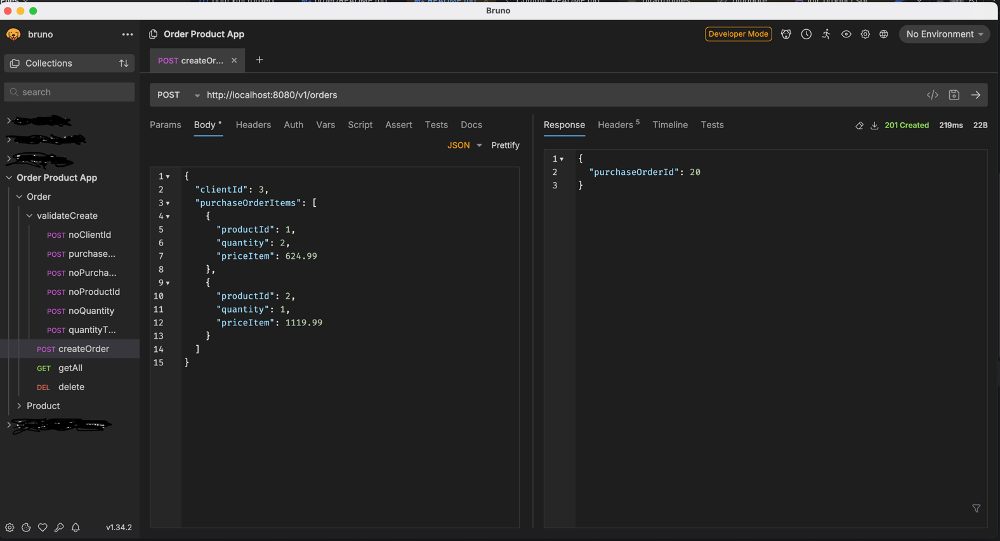

# Order and product app

Two microservices order and product for climbing shop.

Project for learning purpose, huge thanks to viniciustoni.

## Stack
- Java 21
- Spring Boot
- Quarkus
- PostgreSQL
- Docker

## Run locally 

### Start Postgres database containers

From root directory:

`cd docker && docker-compose up`

Command starts two docker containers with a Postgres. One is DB for order app, second for product app. There is also init migration in docker/config/postgres.

### Start order app

Refer to order/README.md file.

### Start product app 

Refer to product/README.md file.

## Manual test

For manual testing purpose repository contain [bruno](https://www.usebruno.com/) directory with collection of http calls. 

